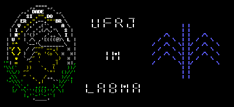
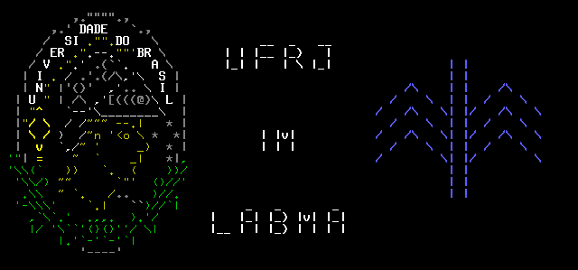
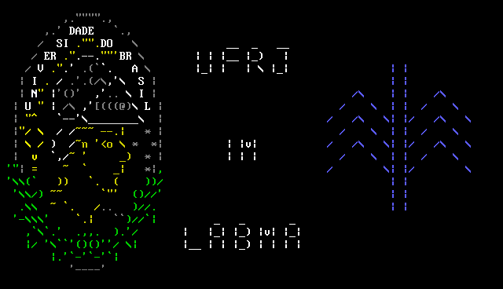

# Minerva ANSI Art

Autor: Denilson F. de Sá (CrazyTerabyte or CrazyTB)

Data: 2004-12-19 (atualizado em 2009-08-05)

## Descrição

Um ANSI Art com a imagem da [Minerva (símbolo da
UFRJ)](https://www.google.com/search?q=minerva+UFRJ&tbm=isch) e o símbolo do
[IM (Instituto de
Matemática)](https://www.google.com/search?q=IM+Instituto+de+Matem%C3%A1tica+UFRJ&tbm=isch).
Um ANSI Art é basicamente um ASCII Art colorido. Usei essa "arte" no LabMA
(Laboratório de Matemática Aplicada).

Demorei 1h30 para desenhar a Minerva, e mais meia hora para desenhar o
símbolo do IM e adicionar o texto.

Criado usando o editor [AEWAN (Ascii-art Editor Without a
Name)](https://aewan.sourceforge.net/). Pode não ser o melhor, mas funciona
bem.

## Arquivos

* [minerva.ae](minerva.ae) - Salvo no formato do AEWAN.
* [minerva.issue](minerva.issue) - Pronto para ser usado no `/etc/issue`.
* [minerva.txt](minerva.txt) - Texto puro com ANSI escapes para deixá-lo colorido.
* [README.md](README.md) - Você o está lendo agora.

## Atualizações

* 2009-08-05- Atualizados `minerva.issue` e `minerva.txt` para usar apenas
  caracteres ASCII. A versão anterior continua disponível (usando encodings
  `utf8` e `latin1`). O arquivo original `minerva.ae` não foi editado.

## Screenshots

